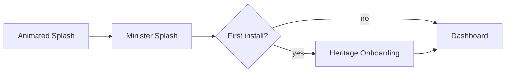

# myKaraikudi — Frontend Architecture Plan

Production-grade architecture for **Expo (mobile)**, **Next.js (web)**, and **Next.js (admin)** sharing design system and API contracts.

---

## 1. Design system (`packages/ui`)

### Theme tokens (premium civic)

| Token | Value | Usage |
|-------|-------|--------|
| `background` | `#FAF7F2` | App canvas |
| `backgroundElevated` | `#FFFFFF` | Cards |
| `accent` | `#B84A4A` | CTAs, highlights |
| `accentMuted` | `#C96B6B` | Secondary actions |
| `textPrimary` | `#1A1A1A` | Headings |
| `textSecondary` | `#5C5C5C` | Body |
| `radius.md` | `16` | Cards |
| `radius.lg` | `24` | Hero modules |

### Component layers

```
packages/ui/
  tokens/          # colors, spacing, typography, motion
  primitives/      # Text, Box, Pressable, Image (lazy + WebP)
  components/      # Card, Chip, SearchBar, ModuleTile
  motion/          # fade, slide, stagger (Reanimated + Framer on web)
  theme/           # ThemeProvider, useTheme
```

**Mobile:** React Native + Expo + `react-native-reanimated` + `expo-image`  
**Web/Admin:** Tailwind v4 mapped to same tokens + `framer-motion`

---

## 2. App navigation structure

### Mobile (`apps/mobile`) — Expo Router

```
app/
  _layout.tsx                 # root providers
  index.tsx                   # splash router
  (onboarding)/
    splash.tsx                # animated "myKaraikudi"
    minister.tsx              # minister cinematic splash
    slides.tsx                # heritage onboarding (first install)
  (tabs)/
    _layout.tsx
    index.tsx                 # dashboard
    mla-updates/
    businesses/
    jobs/
    agri/
    sos/
    volunteers/
    welfare/
    events/
    grievance/
    citizen-recognition/      # locked placeholder
  (auth)/
    login.tsx                 # OTP (Supabase)
  (modals)/
    post-business.tsx
    post-job.tsx
```

### Web (`apps/web`)

Mirror mobile modules as responsive routes under `app/(platform)/`. Public browse without auth; gated actions prompt login modal.

### Admin (`apps/admin`)

```
app/
  (auth)/login                # email/password
  (dashboard)/
    mla-updates/
    businesses/moderation/
    events/
    agri/
    notifications/
    settings/
```

Role-gated UI: `super_admin` vs `content_admin` from `GET /api/v1/auth/me`.

---

## 3. State & data layer

| Concern | Choice |
|---------|--------|
| Server state | TanStack Query v5 |
| Auth session | Supabase client + secure storage (mobile: `expo-secure-store`) |
| Local UI | Zustand (minimal: onboarding seen, locale) |
| API | `@mykaraikudi/utils` `apiFetch` + module hooks |

### Hook pattern (per module)

```
apps/mobile/src/features/businesses/
  api.ts          # apiFetch wrappers
  hooks.ts        # useBusinesses, useCreateBusiness
  screens/        # UI only
  components/
```

Same structure copied to `apps/web` and `apps/admin` where applicable.

---

## 4. Auth flows

| Actor | Method | When |
|-------|--------|------|
| Citizen | Supabase OTP (phone) | Post business, job, labor, volunteer, blood, SOS setup |
| Guest | None | Full browse |
| Admin | Supabase email/password | Admin app only |

**Client:** attach `Authorization: Bearer <access_token>` to protected routes.  
**Never** expose `SUPABASE_SERVICE_ROLE_KEY` to clients.

---

## 5. Launch UX sequence



- Persist `onboarding_completed` in MMKV / localStorage.
- Info button on dashboard reopens onboarding via `GET /api/v1/app/onboarding`.

**Motion budget:** 300–500ms transitions; 60fps target; reduce motion respects OS setting.

---

## 6. Module UI guidelines

| Module | UX notes |
|--------|----------|
| Dashboard | 2-column grid of rounded module cards, parallax header |
| MLA Updates | News cards, hero image, skeleton loaders |
| Businesses | Search + category chips + location; daily-random order from API |
| Jobs | Simple list, external apply via tel:/mailto:/link |
| Agri | Tabs: Mandi / Labor / Weather / Services |
| SOS | Countdown modal (3–30s) before call/SMS |
| Volunteers | Groups list + blood donor filter |
| Welfare | Dynamic form from `form_schema` JSON |
| Events | Timeline cards + push opt-in prep |
| Grievance | Single elegant screen, tap-to-call AI number |
| Citizen Recognition | Blurred locked card + teaser |

---

## 7. Images & performance

- **One image per entity** (enforced in forms).
- `expo-image` / Next `<Image>` with `loading="lazy"`, WebP, width hints.
- CDN: Supabase Storage public URLs; transform params when enabled.
- Lists: FlashList (mobile), virtualized tables (admin).

**Targets:** LCP < 2.5s on 4G; TTI < 3s; 60fps scroll.

---

## 8. Notifications (FCM-ready, not wired)

```
features/notifications/
  device-register.ts    # POST /notifications/devices on app launch
  history.ts            # GET /notifications/history (authed)
  fcm.adapter.ts        # stub → implement with @react-native-firebase/messaging
```

Guest devices register with `is_guest: true` for broadcast alerts.

---

## 9. i18n

- `i18next` + `react-i18next`
- Namespaces: `common`, `dashboard`, per-module
- Default: Tamil (`ta`); English fallback
- Notification locale field synced on device register

---

## 10. Folder structure (target)

```
apps/mobile/src/
  features/
  shared/
  lib/supabase.ts
  lib/query-client.ts

apps/web/src/          # same feature layout
apps/admin/src/

packages/ui/src/
packages/types/src/
packages/constants/src/
packages/utils/src/
```

---

## 11. Environment variables

| App | Variables |
|-----|-----------|
| Mobile/Web | `EXPO_PUBLIC_SUPABASE_URL`, `EXPO_PUBLIC_SUPABASE_ANON_KEY`, `EXPO_PUBLIC_API_URL` |
| Admin | `NEXT_PUBLIC_*` equivalents |
| Backend only | `SUPABASE_SERVICE_ROLE_KEY` |

---

## 12. Implementation phases

1. **Foundation** — tokens, UI primitives, API client, splash/onboarding  
2. **Read modules** — dashboard + MLA, businesses, jobs, events (guest)  
3. **Auth-gated writes** — post business/job, registrations  
4. **SOS + welfare** — countdown UX, dynamic forms, eligibility  
5. **Admin** — moderation, content CRUD, notification queue  
6. **Polish** — motion, Tamil copy, performance pass, launch QA  

---

## 13. Security checklist (client)

- [ ] Certificate pinning (optional phase 2)
- [ ] No secrets in bundle
- [ ] Deep links validated
- [ ] SOS trigger requires auth + confirmed countdown
- [ ] Admin routes behind role check

---

*Backend contract: all routes under `/api/v1` with `{ success, data, meta? }` responses.*
